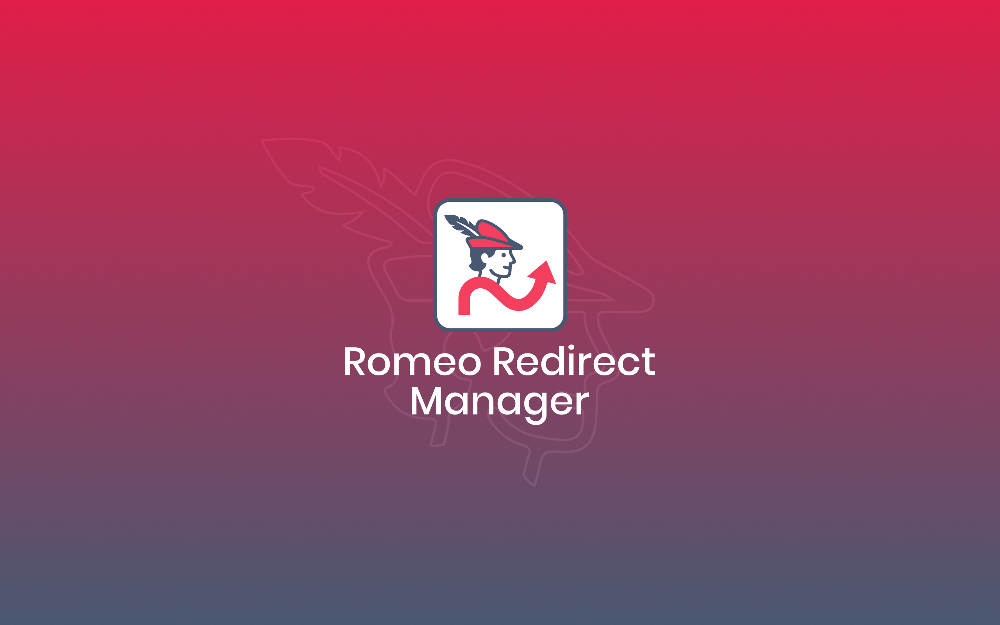
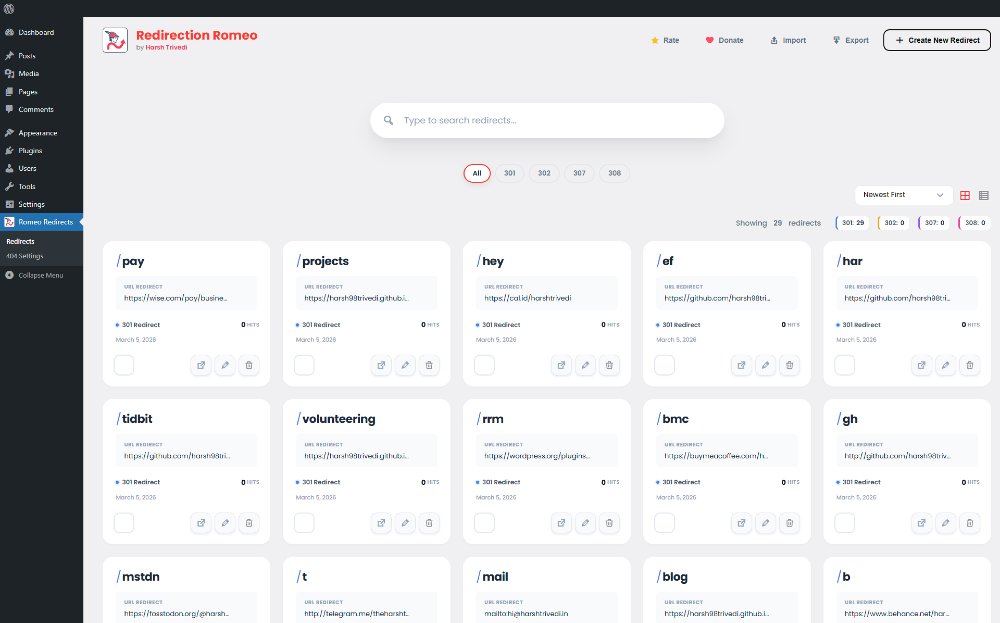
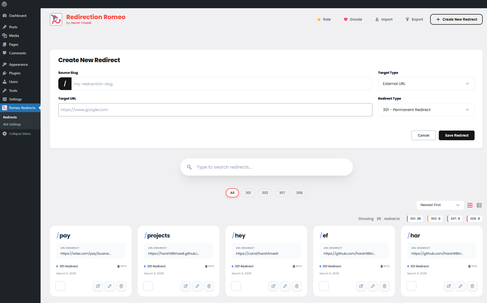
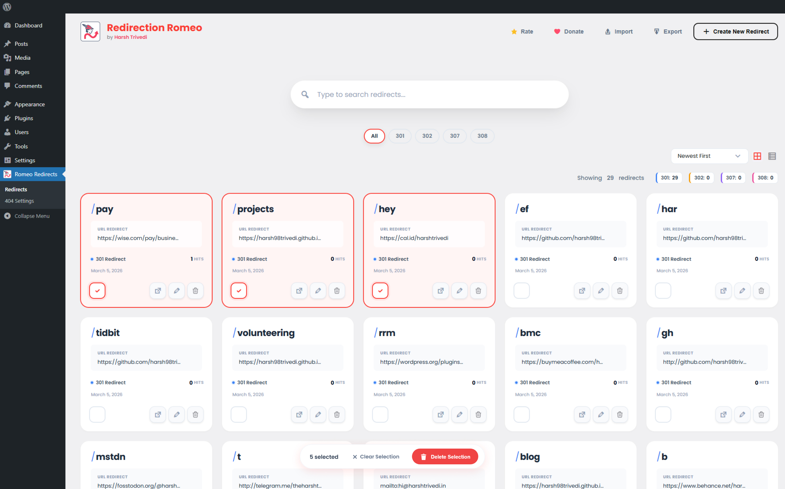
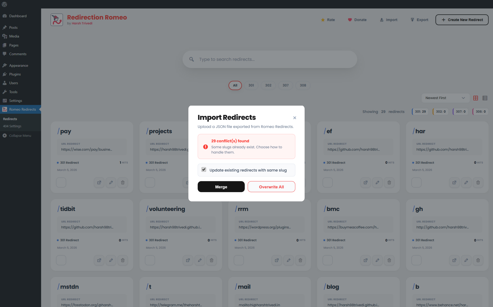

# Romeo Redirect Manager

**Romeo Redirect Manager** is a modern, lightweight WordPress plugin designed to make redirect management effortless and beautiful. Say goodbye to clunky tables and outdated interfaces — welcome to a sleek, card-based dashboard that supports the latest SEO standards, including **308 Permanent Redirects**.

---

## ✨ Features

| Feature | Description |
|---------|-------------|
| 🎨 **Modern UI/UX** | Beautiful card-based interface that feels like a modern SaaS app |
| 🔗 **Full Standard Support** | Supports **301**, **302**, **307**, and **308** status codes |
| 🔍 **Instant Search** | Real-time, optimistic search filtering to find redirects instantly |
| 📝 **Internal Linking** | Intelligent autocomplete for Posts and Pages |
| ⚡ **Performance Focused** | Lightweight native JavaScript with zero heavy dependencies |
| 📊 **Hit Counting** | Track redirect popularity with built-in hit counters |

---

## 📸 Screenshots

| Dashboard | Creator Panel |
|-----------|---------------|
|  |  |

| Bulk Actions | Mobile Responsive |
|--------------|-------------------|
|  |  |

---

## 📦 Installation

### 📥 Download

👉 [**Click here to Download**](https://github.com/harsh98trivedi/Redirection-Romeo/releases/download/1.0.0/romeo-redirect-manager.zip)

### From WordPress Admin
1. Download the latest release `.zip` file from the link above
2. Go to **Plugins → Add New → Upload Plugin**
3. Upload the zip file and click **Install Now**
4. Activate the plugin

### Manual Installation
1. Download or clone this repository
2. Upload the `romeo-redirect-manager` folder to `/wp-content/plugins/`
3. Activate **Romeo Redirect Manager** from the WordPress admin dashboard
4. Navigate to the **Romeo Redirect Manager** menu item in the sidebar

---

## 🛠️ Usage

### Creating a Redirect

1. Click the **"Create New Redirect"** button
2. Enter your desired **Source Slug** (e.g., `my-offer`)
3. Select the **Target Type**:
   - **External URL**: Enter any web address (e.g., `https://google.com`)
   - **Internal Post**: Type to search for any page or post on your site
4. Choose your **HTTP Code** (Recommend `308` for modern permanent redirects)
5. Click **Save**

### HTTP Status Codes

| Code | Type | Use Case |
|------|------|----------|
| **301** | Moved Permanently | Traditional permanent redirect |
| **302** | Found | Temporary redirect |
| **307** | Temporary Redirect | Temporary redirect (preserves method) |
| **308** | Permanent Redirect | Modern permanent redirect (preserves method) |

### Managing Redirects

- **Search**: Use the rounded search bar to filter redirects by slug or target
- **Edit**: Hover over any card and click the ✎ Edit icon to modify it
- **Delete**: Hover and click the 🗑 Trash icon to remove a redirect

---

## 🔧 Requirements

- **WordPress**: 5.6 or higher
- **PHP**: 7.4 or higher
- **Tested up to**: WordPress 6.9

---

## 🤝 Contributing

Contributions are welcome! Please feel free to submit a Pull Request.

1. Fork the repository
2. Create your feature branch (`git checkout -b feature/AmazingFeature`)
3. Commit your changes (`git commit -m 'Add some AmazingFeature'`)
4. Push to the branch (`git push origin feature/AmazingFeature`)
5. Open a Pull Request

---

## 📝 License

Distributed under the **GPL-2.0+** License. See [`LICENSE`](LICENSE) for more information.

---

For questions, feature requests, or customizations:
- 🐛 [Open an Issue](https://github.com/harsh98trivedi/Redirection-Romeo/issues)
- 🔗 [Contact Me](https://harsh98trivedi.github.io/links)

---

## ⭐ Support

If you find this plugin helpful, please consider:
- ⭐ Starring this repository
- 📣 Sharing it with others
- 🐛 Reporting bugs or suggesting features

## 👨‍💻 Author

**Made with ❤️ by [Harsh Trivedi](https://harsh98trivedi.github.io/)**